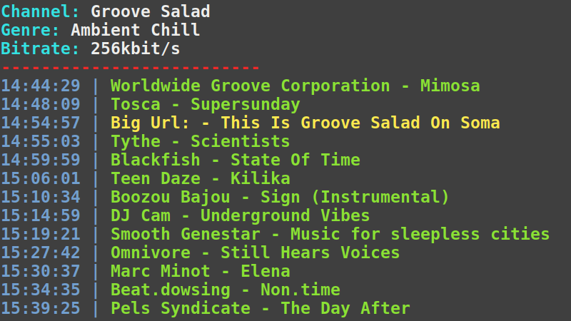
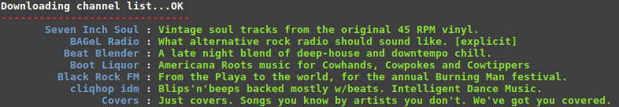
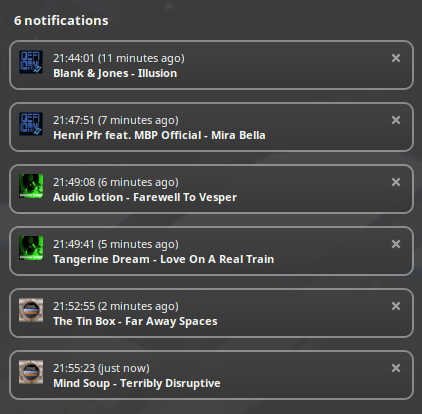

# Python SomaFM Player
This simple player for [SomaFM](https://somafm.com/) keeps the distractions, and system resource utilization, to an absolute minimum. The look of this player was inspired equally by the excellent SomaFM terminal interfaces which were already available, and the 90's hacker aesthetic that I seem to find myself nostalgic for when listening to a Shoutcast stream at 2AM.

As of the current version, the player supports completely unnecessary features like desktop notifications and Chromecast support at no extra charge.

For an up-to-date list of what's new, check the [Changelog](CHANGELOG.md)

## Installation
Starting with version 1.5, this stable version of this program is available on PyPi and can be installed with the following command:

```console
pip3 install somafm
```

## Dependencies
Using this program requires the Python 3 versions of the following libraries:

* [colorama](https://pypi.org/project/colorama/)
* [requests](https://3.python-requests.org/)

## Usage
Simply running `somafm` with no options will start streaming "Groove Salad." In the somewhat unlikely event you wanted to listen to something else, simply give it the channel name like so:

```console
./somafm "DEF CON Radio"
```

Channel entry is not case sensitive and uses a certain amount of "fuzzy" matching. So rather than typing out the entire name, the following will also work:

```console
./somafm def
```
In addition, the following options are available:

#### --list
Download the latest master list of SomaFM channels and display their descriptions.



#### --stats
This option shows the number of listeners for each currently online SomaFM channel, along with a total listener count.

#### --cast
If you have the [pychromecast](https://github.com/balloob/pychromecast) library installed, this option will start playback of the given SomaFM channel on the Chromecast device specified by the `chromecast_name` variable.

## Supported Players
This program is simply a front-end, playback requires one of these media players to be installed:
* [MPlayer](http://www.mplayerhq.hu/design7/news.html) (Best choice)
* [mpg123](https://www.mpg123.de/) (Lightweight, but lacks AAC support)
* [mpv](https://mpv.io/) (Slow to start stream, minimal functionality)

## Desktop Notifications
There is currently experimental support for desktop notifications on Linux using libnotify. They can be enabled by changing the value of the boolean variable `desktop_notifications` or turned on temporarily with the `-n` option.



## Future Development
While the script is already at a point where I would consider it feature complete, there are a few things I think might be interesting to look into:

* Random channel selection
* Display keyboard controls during playback
* ~~Support other players (mpv/VLC)~~
* ~~Filter station IDs from track listing~~
* ~~Desktop notifications on new track~~

If you have an idea for a feature you'd like to see, let me know.

In addition, the only testing done so far has been on Linux. Presumably it can work on other operating systems with some tweaks, so if you've got a PR to make it work on your OS of choice, I'd be happy to take a look at it.

## About SomaFM


SomaFM is a listener-supported Internet-only radio station. That means no advertising or annoying commercial interruptions. SomaFM's mission is to search for and expose great new music which people may otherwise never encounter.

If you like what you hear on SomaFM and want to help, please consider visiting their site and [making a donation](https://somafm.com/support/).

## License
This program is free software; you can redistribute it and/or modify it under the terms of the GNU General Public License version 3 as published by the Free Software Foundation.


This program is distributed in the hope that it will be useful, but WITHOUT ANY WARRANTY; without even the implied warranty of MERCHANTABILITY or FITNESS FOR A PARTICULAR PURPOSE.

For details, see the file "COPYING" in the source directory.
